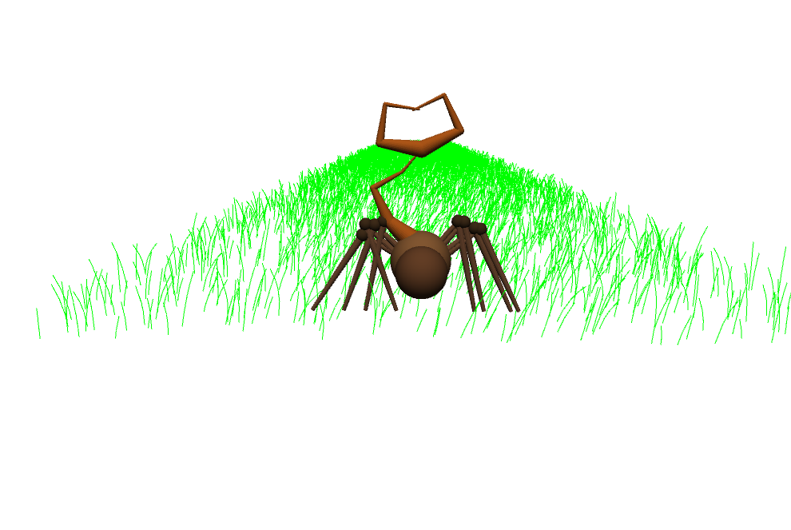
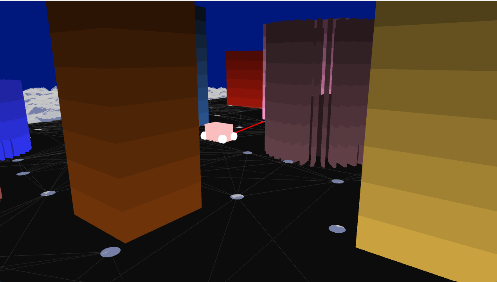

# Project-3

## Part 1: Scorpion Simulation Project
---

### Overview
This project involves the creation of a dynamic 3D simulation of a scorpion. The scorpion is designed to interact with its environment, which includes elements like grass blades and a customizable background. The simulation is built using Processing, a flexible software sketchbook and language for learning how to code within the context of the visual arts.

### Key Features

- **Scorpion Model:** The centerpiece of this simulation is a 3D scorpion model. This model includes several legs and tails, all of which are animated to mimic the movements of a real scorpion.

- **Dynamic Interaction:** The scorpion's movement and behavior are influenced by the user's interactions, such as mouse movements, simulating a responsive creature.

- **Environment:** The scorpion interacts within a digitally rendered environment, which includes grass blades that sway and a customizable background image.

- **Animation and Physics:** The scorpion's legs and tails have been programmed to move in a realistic manner, using principles of physics and kinematics for a lifelike representation.

### Technical Details

- **Leg and Tail Movements:** The code includes advanced algorithms for the movement of the scorpion's legs and tails, ensuring smooth and natural motion.

- **Interactive Environment:** Users can interact with the simulation through mouse movements, influencing the scorpion's motion and behavior.

- **Customization Options:** The environment, including the grass and the background, can be customized for varied visual experiences (at least I tried).

- **3D Rendering:** The scorpion and its environment are rendered in 3D.

---

## Part 2: Autonomous Vehicle Terrain Navigation Simulation

### Overview
This project simulates an autonomous vehicle navigating through a complex 3D environment. The environment includes dynamic terrain and obstacles in the form of buildings. The simulation utilizes principles of probabilistic roadmaps (PRM) for pathfinding and is developed using Processing.

### Key Features

- **Autonomous Vehicle:** A central component of the simulation, the vehicle (referred to as 'car' in the code) autonomously navigates the terrain, avoiding obstacles and aiming for a designated goal.

- **Dynamic Environment:** The environment includes a terrain that can be procedurally generated and a set of buildings serving as obstacles. 

- **Pathfinding Algorithm:** The simulation uses a Probabilistic Roadmap (PRM) method, a common technique in robotic path planning, to find viable paths for the vehicle to navigate through the environment.

### Technical Details

- **Terrain and Obstacle Generation:** The terrain is generated using noise functions, creating a varied landscape. Buildings are placed randomly but with collision avoidance logic to ensure they don't overlap.

- **Vehicle Movement:** The vehicle's movement is calculated based on the PRM algorithm, considering the vehicle's size and the environment's constraints.

- **User Interaction:** Users can interact with the simulation by pressing specific keys to reset the environment, and toggle between different modes of operation.

- **3D Rendering and Camera Control:** The environment is rendered in 3D, and the camera can be controlled to follow the car or to have a static position, offering different perspectives of the simulation.

### Key Controls for PRM Car

- **`r` Key:** 
  - Resets and initializes the environment.
  - Resets and initializes the buildings.
  - Reinitializes the PRM (Probabilistic Roadmap) to clear the previous state.
  - Rebuilds the PRM with the new environment and buildings.

- **Spacebar (` `):**
  - Enables the update method to run, allowing the PRM car to start or continue its movement.

- **`p` or `P` Key:** 
  - Activates the follow-car mode, where the camera follows the PRM car, providing a dynamic view of its movement.

- **`o` or `O` Key:** 
  - Deactivates the follow-car mode, reverting the camera to its standard position.

